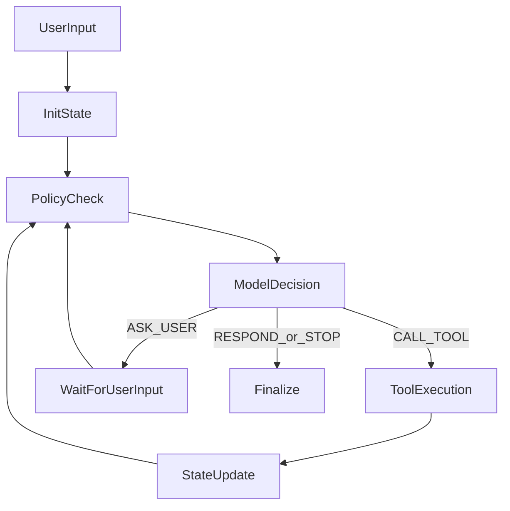
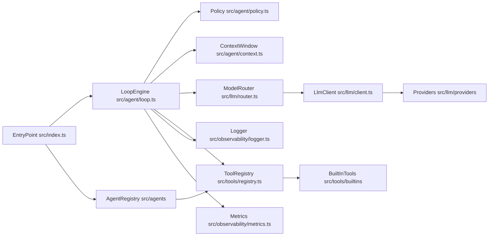

<p align="center">
  
</p>

# Hello Agent

## Agentic Loop Framework

This project is a beginner-friendly foundation for building **agentic loops** in TypeScript.

If you are new to AI programming, this repo is meant to show the core pattern:

1. [ ] keep state,
2. [ ] ask a model what to do next,
3. [ ] optionally call tools,
4. [ ] update state,
5. [ ] stop safely when done.

The current behavior is intentionally simple so you can plug in your own workflow later.

## What Is An Agentic Loop?

An agentic loop is a repeated decision cycle where the model can choose actions (respond, ask user, call a tool, or stop) based on current state.



## Quick Start

1. Enable Corepack (one-time):

   ```bash
   corepack enable
   ```

2. Install dependencies:

   ```bash
   yarn install
   ```

3. Create local env file:

   ```bash
   cp .env.example .env
   ```

4. Run the project:

   ```bash
   yarn dev
   ```

5. Trigger a tool call:

   ```bash
   yarn dev --agent echo "echo: hello from tool"
   ```

6. Try an interactive agent (`ASK_USER` / `awaiting_user` flow):

   ```bash
   yarn dev --agent interviewer
   ```

7. List available agents:

   ```bash
   yarn dev --list-agents
   ```

## Core Concepts In This Repo

- `Provider`: model backend (`rule`, `openai`, `anthropic`)
- `Model target`: pair of `{ provider, model }`
- `Agent plugin`: modular agent definition (prompt + tools + metadata)
- `Tool`: function the model can request (`echo` is the starter tool)
- `Loop policy`: hard safety rules (step limits, timeout, repeat-decision stop)
- `State`: conversation + loop counters + final answer
- `Observability`: logs and in-memory metrics for each run

## High-Level Architecture



## Architecture Deep Dive

### 1) Entry + Wiring

- `src/index.ts` wires config, logger, metrics, LLM client, and tools.
- It resolves a selected agent (`--agent`) from `src/agents/registry.ts`.
- It resumes loop execution when reason is `awaiting_user` using `@inquirer/prompts`.

### 2) Loop Engine

- `src/agent/loop.ts` is the orchestrator.
- It performs:
  - policy check,
  - model decision,
  - optional tool execution,
  - state update,
  - termination.

### 3) Model Layer

- `src/llm/client.ts` is provider-agnostic and routes by provider name.
- `src/llm/providers/` contains provider adapters:
  - `ruleProvider.ts` is implemented for deterministic local behavior.
  - `openaiProvider.ts` is implemented for real OpenAI decision calls.
  - `anthropicProvider.ts` is scaffolded for future integration.
- `src/llm/router.ts` provides primary + fallback model routing.

### 4) Tool Layer

- `src/tools/contracts.ts` defines tool contracts and retry/idempotency metadata.
- `src/tools/registry.ts` handles registration, input validation, retries, and execution.
- `src/tools/builtins/echo.ts` is a minimal example tool.

### 5) Safety + Reliability

- Hard limits:
  - `maxSteps`
  - `maxToolCalls`
  - `timeoutMs`
- Context window cap:
  - `maxMessages`
- Repeat-decision guard:
  - `maxRepeatedDecisionSignatures`
- `ASK_USER` action pauses execution with `awaiting_user` reason for safe turn-by-turn interactions.
- Non-idempotent tools are not retried.
- Idempotent tools can retry on retryable errors only.

### 6) Validation + Observability

- `zod` validates config, model decision shape, and tool inputs.
- `pino` logs structured lifecycle events.
- in-memory metrics track counters and timings for loop/model/tool operations.

## Project Structure

- `src/index.ts` - app entrypoint
- `src/agents/` - multi-agent plugin contracts, registry, and built-ins
- `src/config.ts` - env parsing and defaults
- `src/types.ts` - shared types
- `src/errors.ts` - standardized error classes
- `src/agent/` - loop orchestration and policy
- `src/llm/` - model client, schemas, routing
- `src/llm/providers/` - provider adapters
- `src/tools/` - tool contracts, registry, and built-ins
- `src/observability/` - logs and metrics
- `src/prompts/` - base prompts and examples
- `src/utils/` - retry helper
- `tests/` - unit tests for config, loop, tools, and provider routing

## Environment Variables

- `LLM_PROVIDER` / `LLM_MODEL`: primary model target
- `LLM_FALLBACK_MODELS`: fallback targets, comma-separated
  - Example: `openai:gpt-4.1-mini,openai:gpt-4.1-nano`
- `OPENAI_API_KEY`, `ANTHROPIC_API_KEY`: provider credentials
- `LOOP_MAX_STEPS`, `LOOP_MAX_TOOL_CALLS`, `LOOP_TIMEOUT_MS`
- `LOOP_MAX_MESSAGES`, `LOOP_MAX_REPEAT_DECISION_SIGNATURES`
- `LOG_LEVEL`

## Scripts

- `yarn dev` - run in dev mode
  - `yarn dev --agent echo "echo: hello"` for tool demo
  - `yarn dev --agent interviewer` for interactive question flow
  - `yarn dev --agent country-hello` for favorite-country guess + native greeting (starts with `What is your name?`)
  - `yarn dev --list-agents` to see registered agents
- `yarn smoke:openai` - run a one-shot OpenAI adapter health check with clear auth/quota/network diagnostics
- `yarn build` - compile to `dist/`
- `yarn start` - run compiled app
- `yarn lint` - type-check
- `yarn test` - run tests
- `yarn format` / `yarn format:write` - format checks/fixes

## How To Add A New Workflow

1. Create a new plugin in `src/agents/builtins/<yourAgent>.ts`.
2. Provide `id`, `description`, `systemPrompt`, and `registerTools(...)`.
3. Register the plugin in `src/agents/index.ts`.
4. Add or update tools in `src/tools/builtins/` with strict zod schemas.
5. Add tests in `tests/` for loop reasons (`completed`, `awaiting_user`) and tool behavior.

## CI Recommendation

Use immutable installs in CI to prevent lockfile drift:

```bash
yarn install --immutable
```

## Next Practical Step

Implement Anthropic provider parity in `src/llm/providers/anthropicProvider.ts`, then add one domain workflow (for example, vacation preference narrowing) as a first-class agent plugin.

## Runtime Notes

- Interactive prompts use `@inquirer/prompts` when available and automatically fall back to Node `readline` for compatibility.
- Timeout is measured per active run turn; waiting time between `ASK_USER` rounds does not consume timeout budget.

## Additional Learning Resource

If you are new to AI engineering, read the beginner primer:

- `docs/agentic-loop-primer.md`
