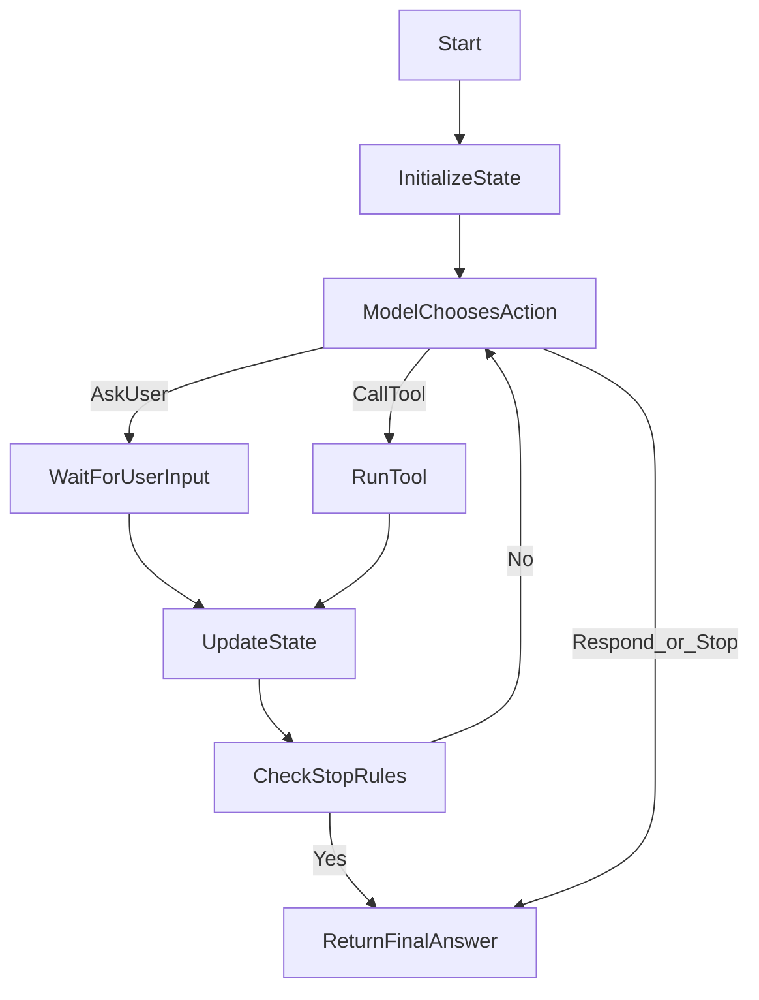

# Agentic Loop Primer

This primer is for people who are new to AI programming and want to understand the core pattern behind "agentic" systems.

## The Big Idea

A basic AI app sends one prompt to a model and gets one answer back.

An **agentic loop** does more:

1. reads the current situation (state),
2. decides what to do next,
3. optionally uses tools,
4. updates state,
5. repeats until done.

That loop structure makes the system more flexible and closer to how a human assistant would work.

## Non-Agent vs Agent (Simple Example)

### Non-agent style (single-shot)

- User: "What is 21 \* 4?"
- App asks model once.
- Model replies "84".
- Done.

This is great for straightforward tasks.

### Agent loop style

- User: "Summarize this and fetch current weather in my city."
- Model decides to:
  - call a weather tool,
  - combine tool output + user context,
  - produce a final answer.

This is better for multi-step tasks where external data or actions are needed.

## Visual: What Happens In A Loop

## Multi-Agent Pattern

When you want multiple agents, keep one shared runtime and add small agent plugins.

- shared runtime: loop, tools, providers, safety rules
- per-agent plugin: prompt, description, and tool registration
- registry: select agent by id (for example with `--agent interviewer`)

This keeps each new agent simple and avoids duplicating loop logic.
